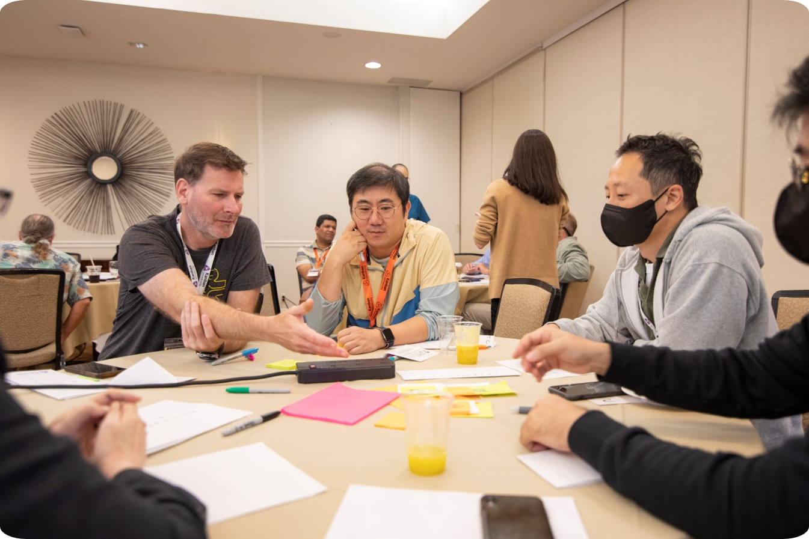

# Accredited Kanban Consultant (AKC) Program

For more than 10 years, Kanban University’s Accredited Kanban Consultants (AKCs) have led the way in improving business outcomes for organizations both large and small. 

They have also advanced the method to include powerful tools used by organizations starting out on their pathway to customer orientation as well as organizations that have matured to be fit-for-purpose in their market. 

Kanban consultants can help your organization overcome challenges to change while moving in a direction of real economic outcomes.

## Vision 

Build a vibrant and diverse community of advocates and seasoned practitioners of the Kanban Method to better support industry.

## The focus

A community of advocates and experienced practitioners of The Kanban Method who are dedicated to advancing our Body of Knowledge, and supporting the community of practitioners that strive to continuously improve the culture and management practices in organizations worldwide.

## How we work as a community

*Collaborate*

Meet in person at our conferences to explore, challenge, and connect on key concepts that either improve or change the body of knowledge.

*Advocate*

We also collaborate to advocate for the Kanban Method through local meetups as well as regional and national conferences. 

*Grow*

Consultants also participate in the recruitment and growth of the community through participating in assessment panels for future consultants. 

### Why become an AKC
- Be recognized as an expert on the Kanban Method
- Gain additional insights into making the business case for change through KLRs and online experiences
- Advance your coaching and mentoring practice by collaborating with fellow AKCs to learn from their experiences and lessons learned to further advance the maturity within an organization
- Have a voice in how the Kanban Method is shaped over time
- Be a part of a global community that continues to advocate for the Kanban Method

### Get Started

[Email us](mailto:akc@kanban.university) and ask for an application or request a meeting with one of our AKCs if you have questions.

    

